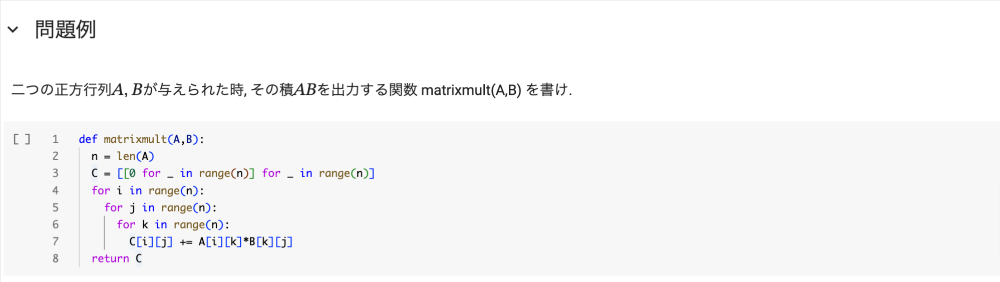

# プログラミング応用 ガイダンス

[清水 伸高](https://sites.google.com/view/nobutaka-shimizu/home) (塩浦研 助教)

2025年3Q

---
layout: top-title
color: amber-light
---

::title::

# 概要

::content::

- **講義**: アルゴリズムの理論的側面と様々な最適化アルゴリズムを学ぶ.
- **演習**: 講義で紹介したアルゴリズムを応用して出題した問題をPythonで解いてもらう.

<v-click>

- ### 評価基準
  - 演習課題 (前日に課題ファイルを提示するので, 1週間後までに提出)
    - Pythonでの実装が中心
    - 最終回の課題(期末課題)は多め(比重が高い)
  - 期末試験はなし

</v-click>

---
layout: top-title
color: amber-light
---

::title::

# 受講に必要な環境

::content::

講義の受講にあたっては以下の環境が**必須**:

<v-clicks>

- 大学のSlackアカウント
  - 講義の連絡や課題ファイルの共有に利用する (LMSでも課題ファイルをDLできる)
  - 手続きについては[こちら](https://portal.isct.ac.jp/ja/sys/slack/guide.html#sign-in)を参照
    - この手続きが済んでいれば, 私の方でチャンネルに追加します.
  - 講義に関する私への連絡は**必ずSlackのDM**で行ってください
  
- LMSへのログイン
  - 課題の提出に利用する
- Pythonの実行環境
  - 個人のGoogleアカウントがあれば, [Google Colab](https://colab.research.google.com/?hl=ja)を利用できる (特に何もインストールしなくてよい).
  - 手元でPythonの環境が整っているならば, それを利用してもよい.

</v-clicks>

---
layout: top-title
color: amber-light
---

::title::
# (個人的に)オススメな環境
::content::

将来的にプログラミングに携わる可能性があるならば, 以下のソフトやスキルを身につけておくとよい:

- **VSCode** (Visual Studio Code)
  - エディタ(プログラムを書くソフト)のデファクトスタンダード
  - 拡張機能が豊富で, Pythonの実行環境も整えやすい
  - 生成AI (GitHub Copilot) を用いたコーディングも可能
    - 最近は生成AIを用いたコーディングに特化したエディタ**Cursor**も人気 (私はこれを使っています)
    
<v-click>    

- **GitHub** (バージョン管理システム)
  - ソースコードの「セーブデータ」の履歴を管理できる (例えば学位論文の執筆で便利)
  - GitHub Pagesを使ってウェブサイトを作成できる
  - VSCodeにはGitHub用の拡張機能がある
  - 踏み込んだ使い方をしようとすると学習コストが高い
  
</v-click>

---
layout: top-title
color: amber-light
---
::title::
# (個人的に)オススメな環境
::content::

- **Markdown形式**
  - テキストファイルの書き方の一つで, 拡張子は`.md`
  - 簡単に言うと「htmlの簡易版」(可読性が高い)
  - Wordで書くよりもAIに学習させやすい
  - このスライドもマークダウン形式で書いている

<v-click>

- **Notion**または**Obsidian**
  - Markdown形式でドキュメントの作成・管理に便利 (勉強ノートや研究ノートの作成に便利)
    - 去年はNotionで[講義資料](https://nobunote.notion.site/112b125551f780cfb468e1542fecd175?v=112b125551f78147a287000cb91ef0c2&pvs=74)を作っています  
  - Notionは初心者でも直感的で使いやすく, Obsidianは拡張機能が豊富で細かいカスタマイズが可能
  - LaTeXで数式の入力も可能

</v-click>

---
layout: top-title
color: amber-light
---
::title::
# 生成AIの利用について
::content::

  生成AIを使ったCodingは推奨

- 例えば, GitHub Copilotを使うと, コードの自動補完やコードの説明をしてくれる
  - Google ColabではGeminiが使える
- ただし, 間違える可能性があるので, 出力されたコードをそのまま使うのではなく, 自分で確認すること
  - この講義の課題は主に数学の問題であり, AIでは解けないことが多い
- もちろん, 自分の力だけで書くのもOK

---
layout: top-title
color: amber-light
---

::title::

# Google Colabについて

::content::

以降はGoogle Colabの説明なのでPythonの実行環境が整っている方は聞かなくても構いません.

<v-clicks>

- 正式名称は**Google Colaboratory** (略称: Colab).
- Googleが提供する**Jupyter Notebook**のクラウド上での実行環境です.
  - Jupyter Notebook: 端的に言うと, プログラミング実行環境と文書をまとめたもの.
    - コードと文章を同じファイルに書けるので, 課題の提出に適している.
    - 拡張子は`.ipynb`
  - 三つの言語(**Ju**lia, **Pyt**hon, **R**)に対応している.
  - ブラウザでGoogle Colabのページにアクセスするだけで利用できる.

</v-clicks>

---
layout: top-title
color: amber-light
---

::title::

# Google Colabの使い方

::content::

アクセスすると以下のような画面が表示される:

  

---
layout: top-title
color: amber-light
---

::title::
# Google Colabの使い方
::content::

右下の「キャンセル」をクリックするとポップアップ画面が消え, 以下のような画面になる:

  

---
layout: top-title
color: amber-light
---
::title::
# Google Colabの使い方
::content::

左上の「ファイル → ノートブックをアップロード」でダウンロードしたipynbファイルをアップロードして開ける:

  

---
layout: top-title
color: amber-light
---
::title::
# Google Colabの使い方
::content::
ダウンロードした課題ファイルを開くと, 以下のような画面になる:

  

コードが書いてある欄(セルと呼ばれる)をクリックして, その中にコードを書いていく.
セル内のコードの実行は, セルを選択してから上部の「▶︎」ボタンをクリック.

  

---
layout: top-title
color: amber-light
---
::title::
# Google Colabの使い方
::content::
書き終わったら, 上部の「ファイル → ダウンロード → .ipynb」を選択して, ipynbファイルをダウンロードし, これをLMSを通じて提出すればよい.

  

---
layout: top-title
color: amber-light
---
::title::
# 記述問題について
::content::

- 課題の中には, コードを書くだけでなく, 数学的な証明や考察を求める記述問題もある.
- その場合は, 解答欄のテキストセルに回答を書いてください (ダブルクリックすると編集できるようになる)
- 数式の入力は, **LaTeX形式でなければならない**
  - セル内に`$数式$`と書くと, 数式が表示される
  - 例えば, `$\int_0^1 x^2 dx = \frac{1}{3}$`と書くと以下のようになります:
  

  

- 数式の入力方法については, 様々なサイトで解説されているので, そちらを参照してください (私に質問しても構いません).
